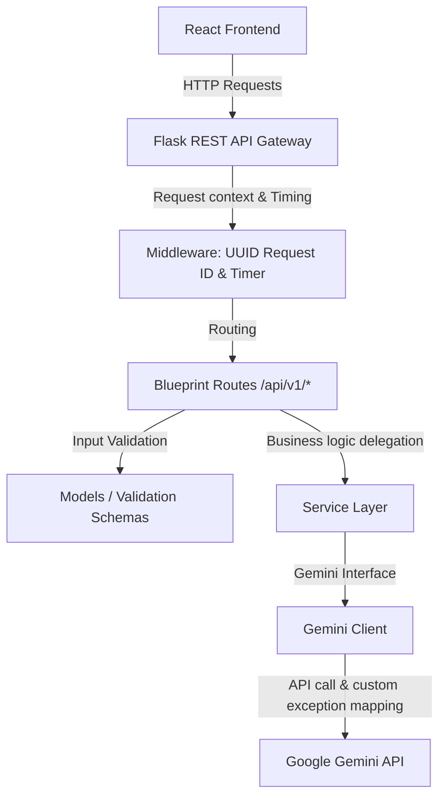

# Rasoi AI Chef - Backend REST API

Welcome to the backend service for **Rasoi**, an AI-powered Indian home cooking companion. This service is a production-ready, clean, and scalable Flask REST API that integrates with the Google Gemini API to suggest recipes and answer culinary questions.

---

## Project Overview

Rasoi API provides:
- Personalized Indian home recipes matching pantry ingredients, time budgets, and dietary goals.
- An interactive, context-aware AI chef chat session for cooking queries.
- Clean OpenAPI/Swagger documentation for easy UI integration.
- Production-grade tracking: request IDs, timing headers, detailed logging, and custom API error mapping.

---

## Architecture

This application is built using clean, modular architectural patterns to ensure strict separation of concerns, scalability, and testability.



### Flow Breakdown
1. **Flask API Gateway (`app.py`)**: Uses the Flask Application Factory pattern. Configures CORS, logging, request interception, and registers endpoints.
2. **Middleware**:
   - **Request ID**: Automatically generates a unique UUID-based Request ID for every incoming request. It attaches it to the request context (`g.request_id`), log formatting, response headers (`X-Request-ID`), and error responses.
   - **Request Timing**: Measures request execution time and appends it to response headers (`X-Response-Time-Ms`) and server logs.
3. **Blueprint Routes (`routes/`)**: Registers versioned API endpoints (`/api/v1/...`) and maps legacy routes (`/api/...`) for backward compatibility.
4. **Validation Schemas (`models/schemas.py`)**: Validates JSON payloads at the route entry point before business logic processing.
5. **Service Layer (`services/`)**: Orchestrates prompt compilation and calls the Gemini client interface.
6. **Gemini Client (`gemini_client.py`)**: Formulates LLM prompts, makes API requests, and maps Google GenAI API errors (like 429, 503, 504) to custom backend exceptions mapping to appropriate HTTP statuses.

---

## Folder Structure

```
rasoi backend/
├── app.py                         # Flask entry point, logging, middlewares & factory init
├── config.py                      # Environment configuration loading & validation
├── gemini_client.py               # Core Gemini API interface & exception handler
├── prompt.py                      # System prompts defining the chef's assistant persona
├── requirements.txt               # Pinned package dependencies
├── .env                           # Environment credentials config
├── Rasoi_API.postman_collection   # Exported Postman collection for validation
├── routes/                        # Blueprints & Controllers
│     ├── __init__.py              # Route versioning & legacy mapping
│     ├── health_routes.py         # Upgraded health status endpoint
│     ├── recipe_routes.py         # Recipe generation endpoint
│     └── chat_routes.py           # AI interactive chef chat endpoint
├── services/                      # Business Logic Service Layer
│     ├── __init__.py
│     ├── recipe_service.py        # Prompts compiler & recipe fetcher
│     └── chat_service.py          # Conversational chat handler
├── models/                        # Request Payloads Verification
│     ├── __init__.py
│     └── schemas.py               # Strict manual payload validator schemas
└── utils/                         # Global helpers
      ├── __init__.py
      ├── response.py              # Consistent success and error JSON response layouts
      └── errors.py                # Custom HTTP status-mapped exceptions
```

---

## Installation & Setup

### 1. Prerequisite
Ensure you have Python 3.9+ installed on your system.

### 2. Install Dependencies
Activate your virtual environment and run:

```bash
# Windows
.venv\Scripts\activate

# Install locked dependencies
pip install -r requirements.txt
```

### 3. Environment Configuration
Verify or create a `.env` file in the root workspace folder:

```env
GEMINI_API_KEY=your_google_gemini_api_key_here
PORT=5000
HOST=0.0.0.0
DEBUG=True
```

---

## Running Locally

To start the API server locally:
```bash
python app.py
```
The server will start listening at `http://127.0.0.1:5000`.

---

## Swagger / OpenAPI Usage

Interactive API documentation is integrated using **Flasgger** and is available at:

[http://127.0.0.1:5000/docs](http://127.0.0.1:5000/docs)

This UI allows you to test endpoints, view JSON request payload structures, response definitions, and error schemas.

---

## API Documentation

All endpoints are versioned under `/api/v1/` and mapped to `/api/` for complete backward compatibility.

### 1. Service Health Status Check
Checks configuration, Flask status, and Gemini API credentials configuration.

- **URL**: `/api/v1/health` (Compatibility: `/api/health`)
- **Method**: `GET`

#### Example Response (200 OK)
```json
{
  "status": "healthy",
  "service": "Rasoi REST API",
  "version": "1.0.0",
  "environment": "development",
  "python_version": "3.10.0",
  "uptime": "0:05:22",
  "timestamp": "2026-08-02T13:05:00.123456Z",
  "gemini_api": "available"
}
```

---

### 2. Generate Recipes
Generates up to three custom Indian recipes from available ingredients.

- **URL**: `/api/v1/recipes/generate` (Compatibility: `/api/recipes/generate`)
- **Method**: `POST`
- **Body Schema**:
  - `ingredients` (String, Required): Pantry items (e.g. `"Paneer, Onion"`).
  - `time` (Integer, Required): Maximum cooking time in minutes.
  - `goal` (String, Optional): Dietary/cooking goal.
  - `cuisine` (String, Optional): Target cuisine.
  - `servings` (Integer, Optional): Servings count.

#### Example Request
```json
{
  "ingredients": "paneer, tomato",
  "time": 30,
  "goal": "Quick Meal",
  "cuisine": "Indian",
  "servings": 2
}
```

#### Example Response (200 OK)
```json
{
  "recipes": [
    {
      "recipe_name": "Quick Paneer Sauté",
      "recommendation_reason": "One-pan sauté ready in under 15 minutes.",
      "total_time_minutes": 15,
      "difficulty": "Beginner",
      "estimated_servings": 2,
      "image_prompt": "Seared golden paneer cubes tossed with tomatoes in a bowl",
      "ingredients": [
        { "name": "paneer", "quantity": "200 g" }
      ],
      "steps": [
        { "instruction": "Chop paneer into cubes." }
      ]
    }
  ]
}
```

---

### 3. Ask Chef Question
Sends context-aware cooking queries to Chef Rasoi regarding a recipe.

- **URL**: `/api/v1/chef/chat` (Compatibility: `/api/chef/chat`)
- **Method**: `POST`
- **Body Schema**:
  - `recipe` (Object, Required): JSON object representing the recipe.
  - `question` (String, Required): User query.
  - `chat_history` (Array, Optional): Optional chat messages history block.

#### Example Request
```json
{
  "recipe": {
    "recipe_name": "Quick Paneer Sauté",
    "ingredients": [{ "name": "paneer", "quantity": "200g" }],
    "steps": [{ "instruction": "Sauté paneer cubes." }]
  },
  "question": "Can I add turmeric to this?",
  "chat_history": []
}
```

#### Example Response (200 OK)
```json
{
  "success": true,
  "message": "Success",
  "data": {
    "response": "Yes! Adding 1/4 teaspoon of turmeric will give Paneer Bhurji its classic golden color."
  }
}
```

---

## Request Validation & Error Handling

Invalid payloads are rejected with custom error structures. All JSON error payloads automatically include the generated Request ID:

### Missing Parameter (400 Bad Request)
```json
{
  "success": false,
  "message": "Missing required field: 'time'.",
  "request_id": "9b1deb4d-3b7d-4bad-9bdd-2b0d7b3dcb6d"
}
```

### Custom Exception Mapping
- **429 Too Many Requests**: Gemini API usage limits reached.
- **503 Service Unavailable**: Gemini AI backend experience overload capacity.
- **504 Gateway Timeout**: Request connection times out.
- **422 Unprocessable Entity**: LLM output parsing failure.

---

## Logging

Logs are formatted cleanly to track request identifiers:
`[Timestamp] [Request ID] LOG_LEVEL in Module: Request Details`

- **Log Directory**: Logs are saved inside the `logs/` directory.
- **Rotator**: Rotates log files dynamically at `10MB` limit, maintaining up to `5` historical backup files.

Example console log trace:
```text
[2026-08-02 12:48:24,768] [N/A] INFO in app: Logging initialized successfully with Request ID filter.
[2026-08-02 12:48:24,772] [N/A] INFO in app: Rasoi API backend is ready to accept requests.
[2026-08-02 12:50:25,494] [8c5db54b-d731-419b-ab9e-a61f5c6a1e3b] INFO in app: GET /api/health - Status:200 - Time:18ms - ClientIP:127.0.0.1 - RequestID:8c5db54b-d731-419b-ab9e-a61f5c6a1e3b
```

---

## Future Improvements

1. **JWT User Authentication**: Secure chat endpoints for session-based historical tracking.
2. **Caching Layer**: Integrate Redis to cache common recipe request shapes to reduce Gemini token consumption.
3. **Rate Limiting**: Apply Flask-Limiter for client-side API throttling.
4. **Structured Image Generation**: Integrate a text-to-image API (e.g. Imagen or DALL-E) using the `image_prompt` field in recipe cards.
